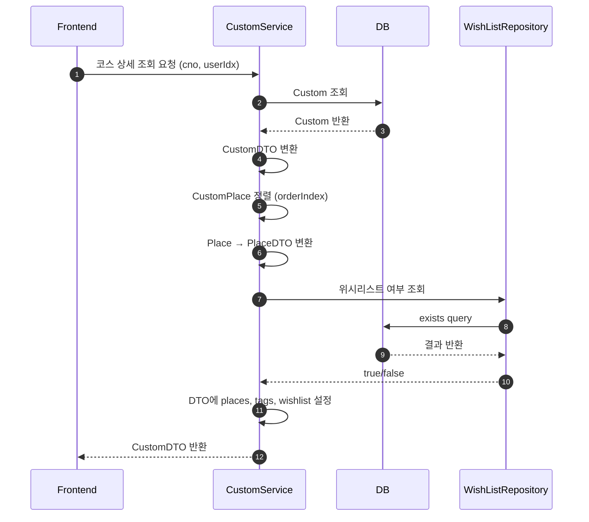
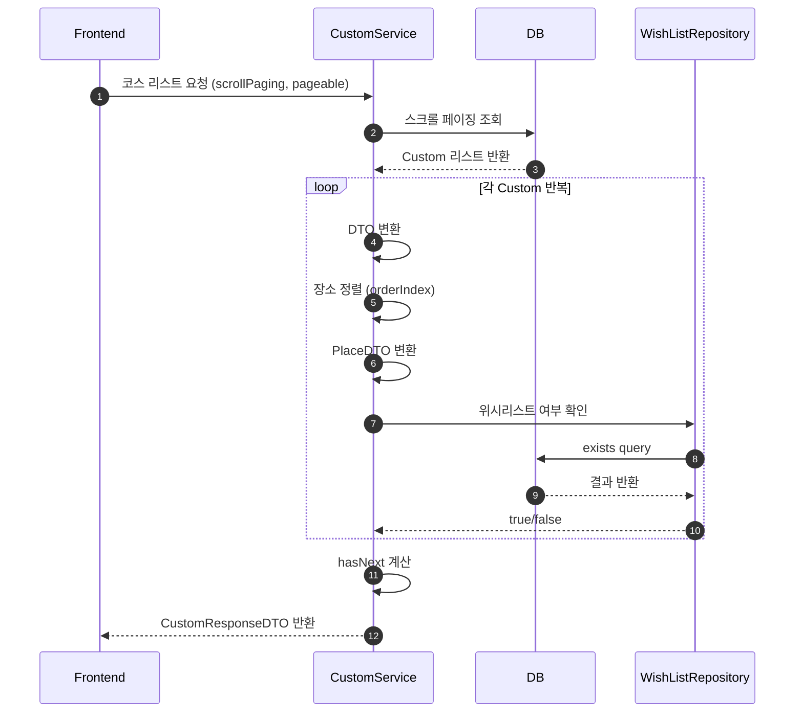
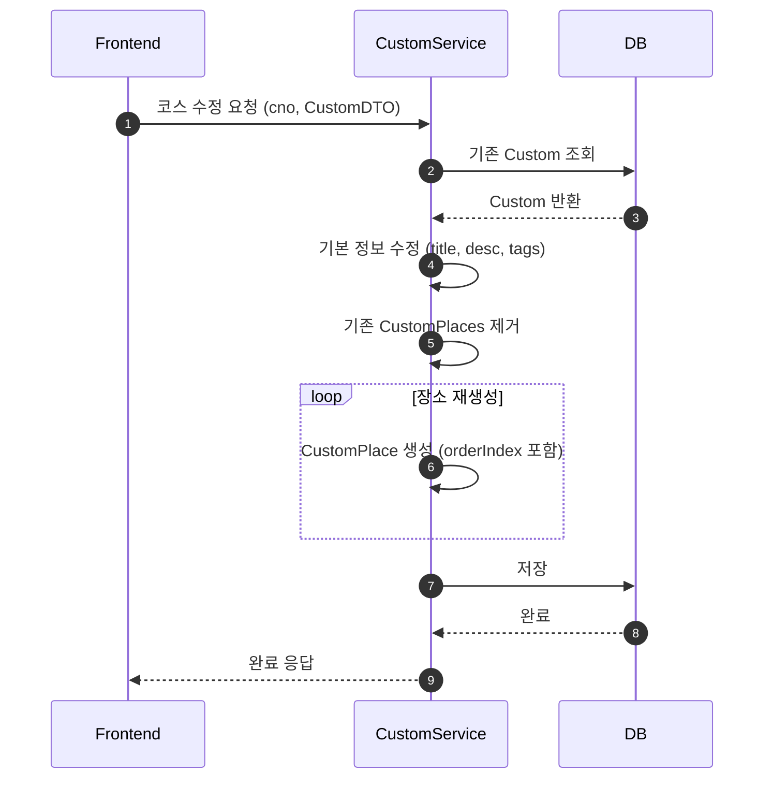
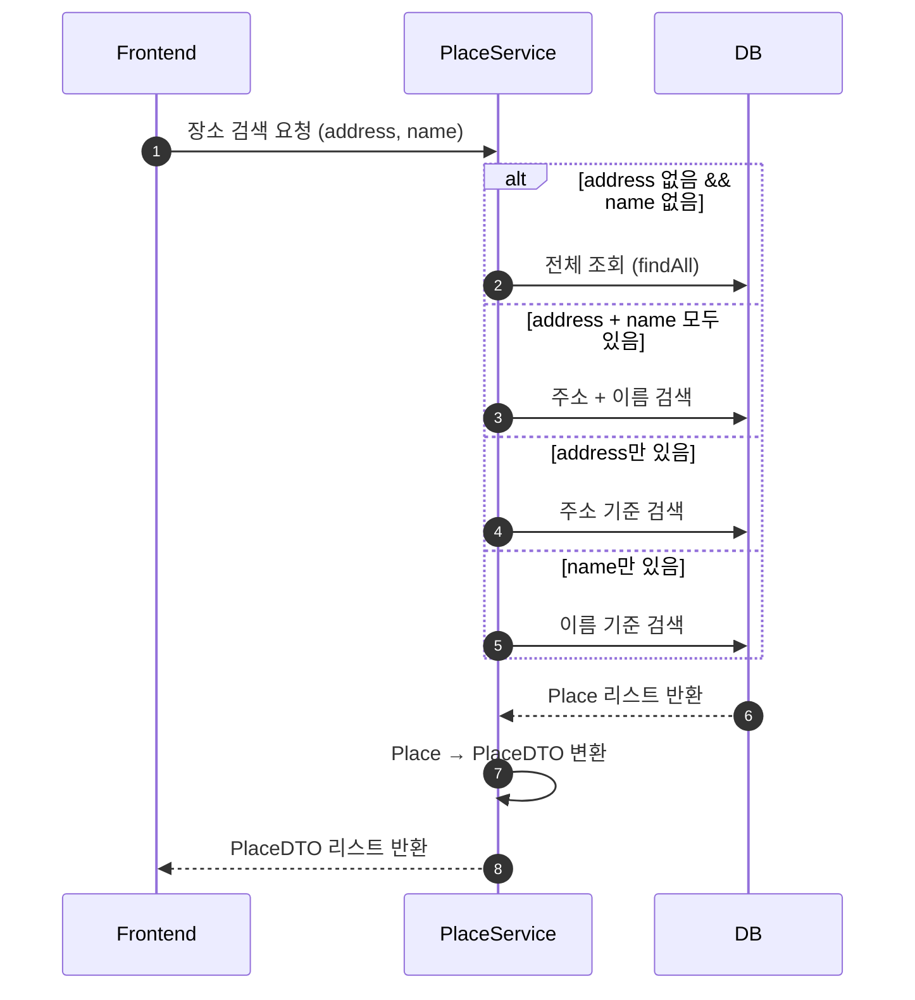
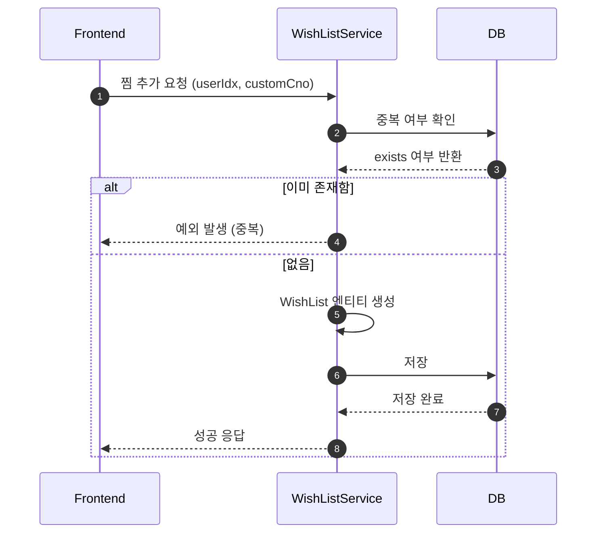
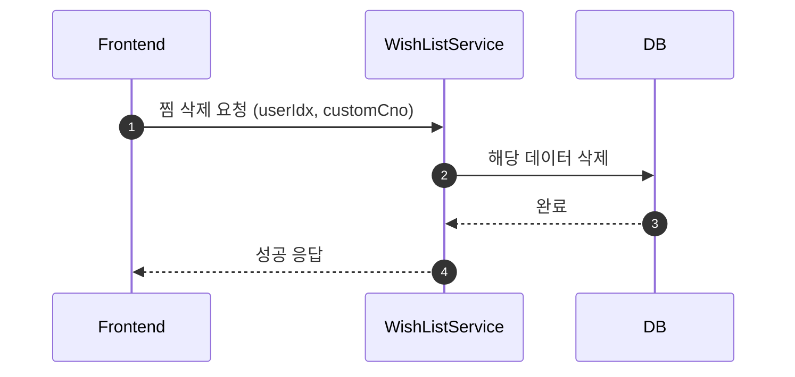
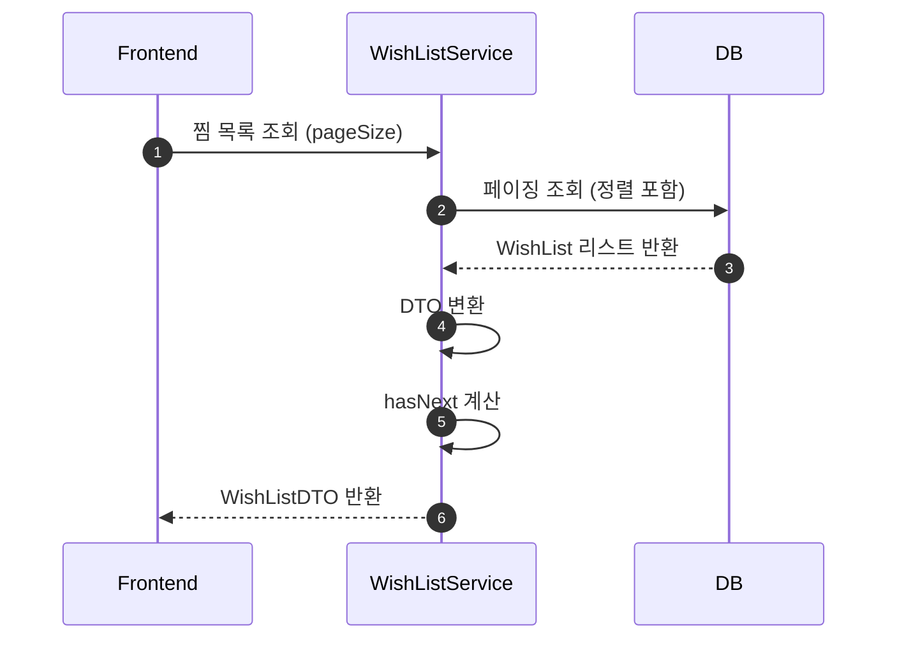
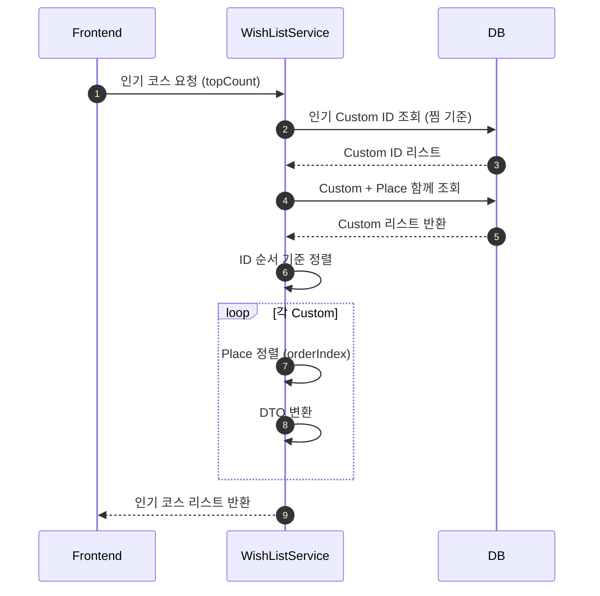
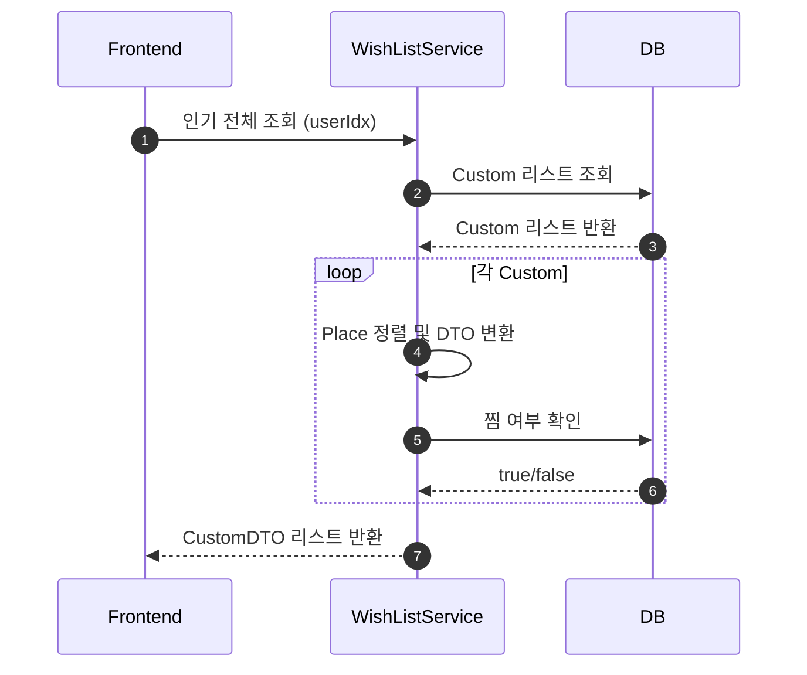

# 시퀀스 다이어그램

## 코스 생성 (register) 시퀀스

## 코스 상세 조회 (get)

## 리스트 조회 (무한 스크롤 포함)

## 업데이트 흐름

## 장소 검색 (searchPlaces)

## 찜 추가 (addWishList)

## 찜 삭제 (removeWishList)

## 내 찜 목록 조회 (getFavoritesByUser)

## 인기 코스 조회 (listPopular)

## 전체 인기 + 사용자 상태 (listPopularAll)

