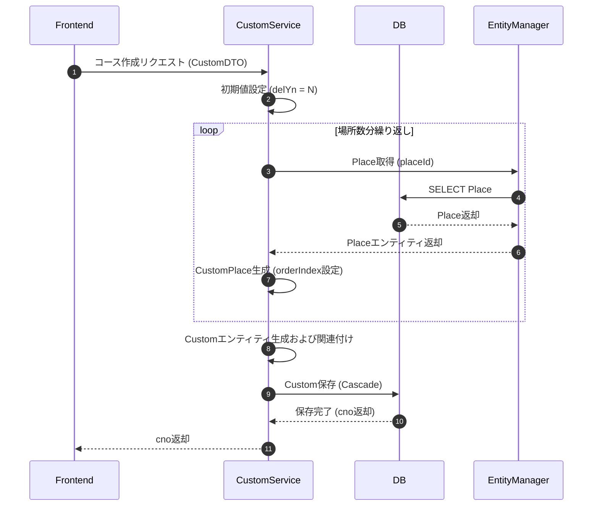
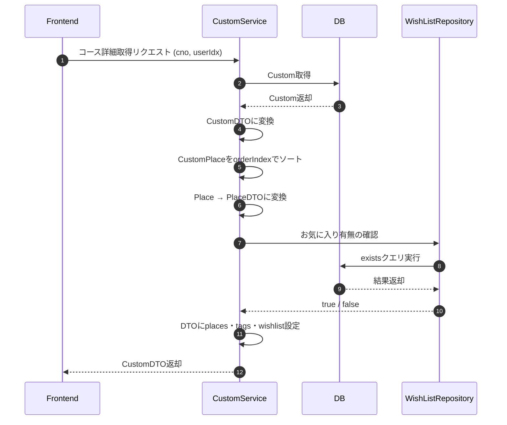
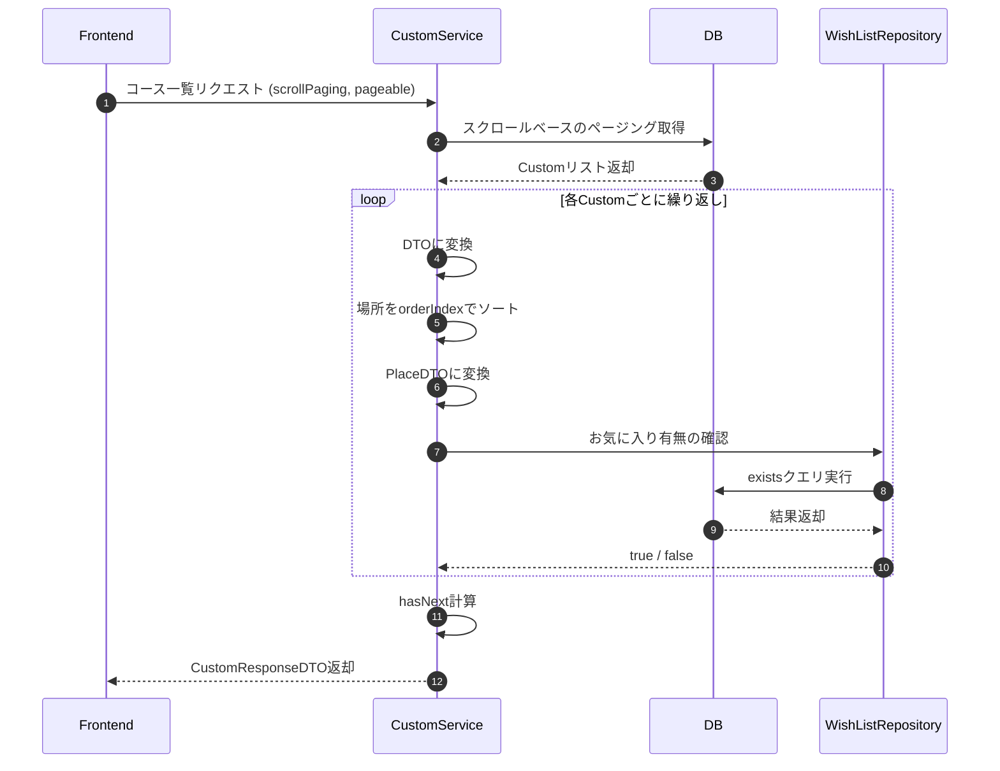
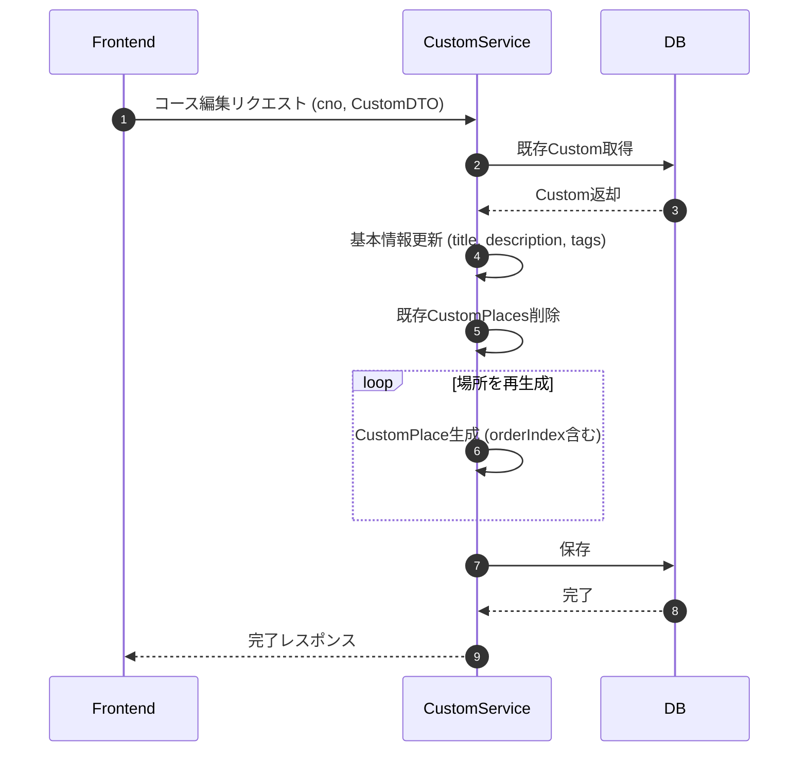
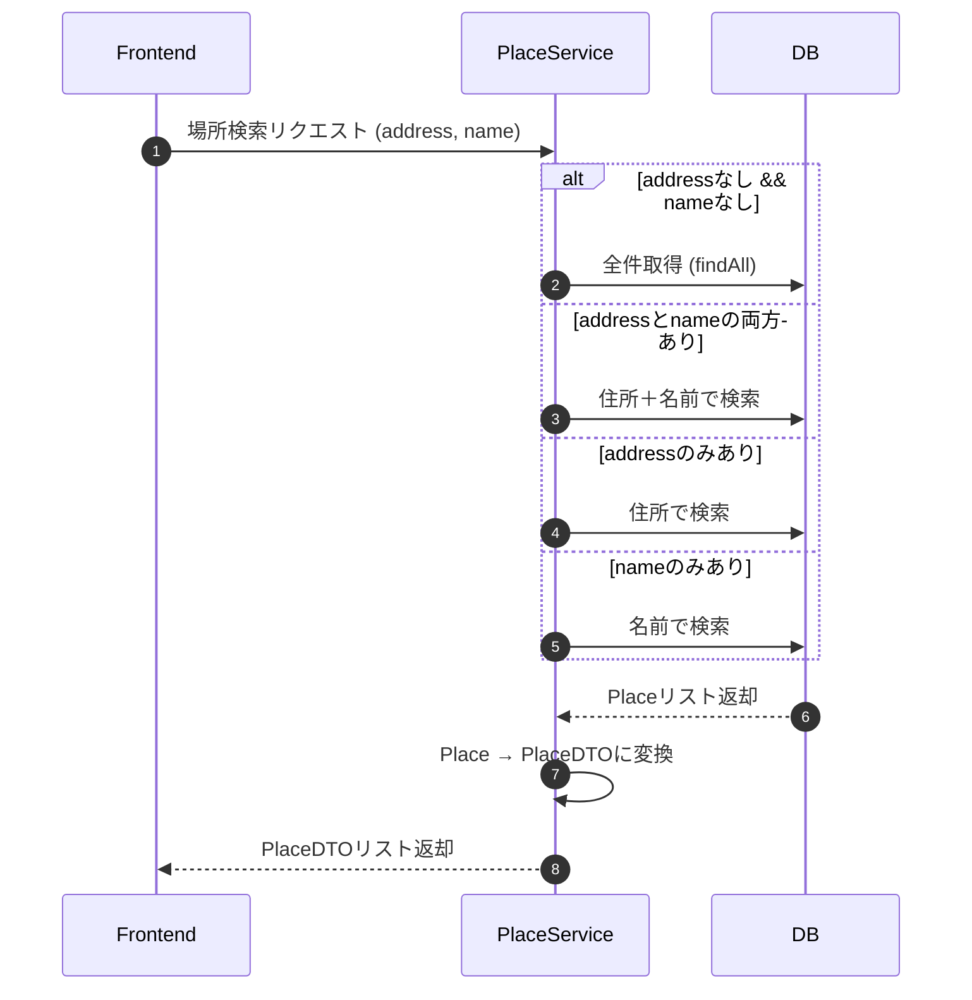
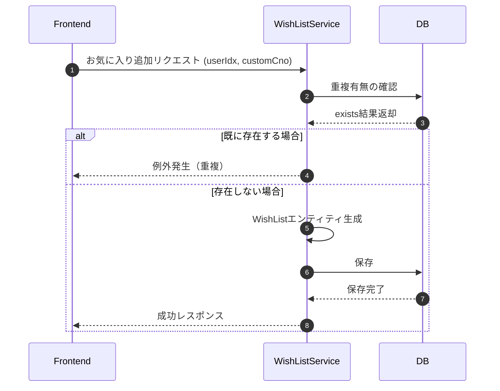
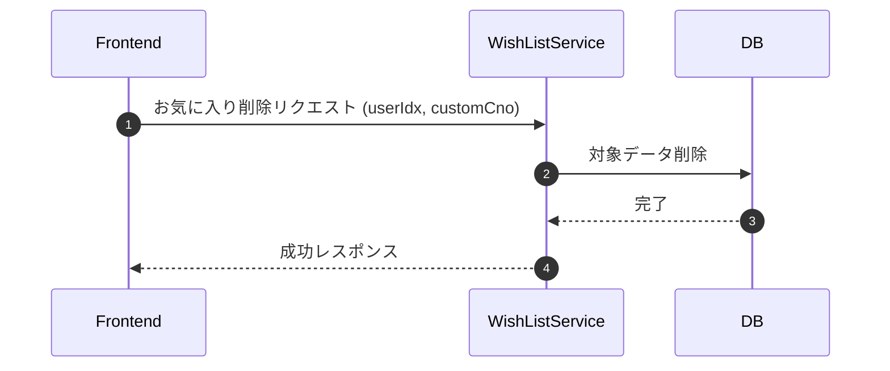
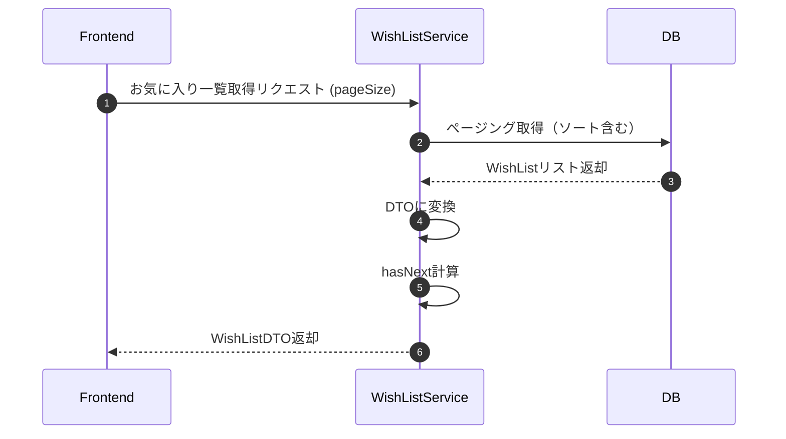
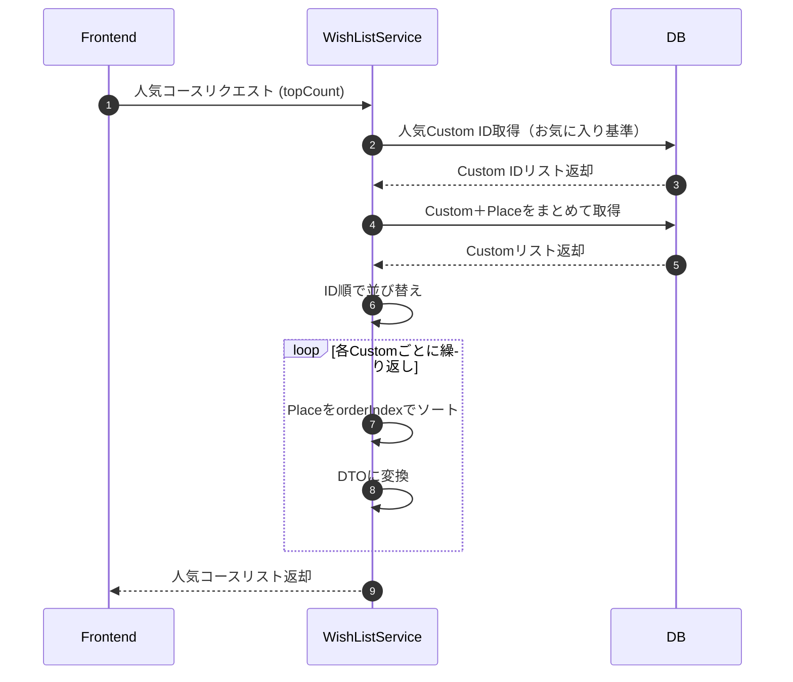
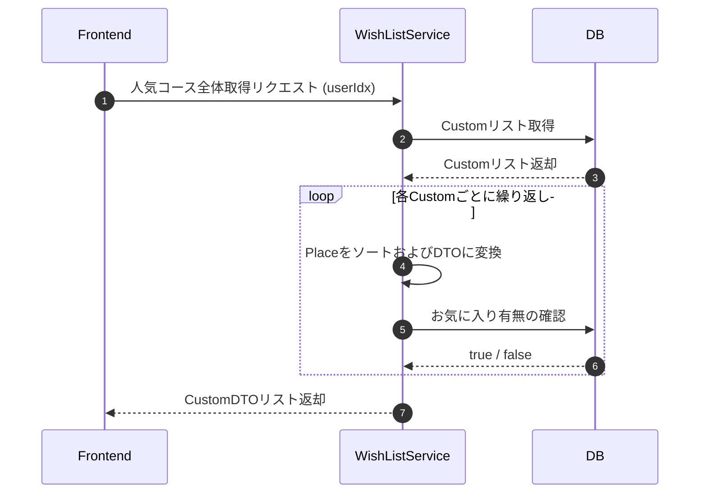

# Sequence Diagrams

## コース作成（register）

## コース詳細取得（get）

## コース一覧取得

## コース編集（update）

## 場所検索 (searchPlaces)

## お気に入り追加（addWishList）

## お気に入り削除（removeWishList）

## お気に入り一覧取得（getFavoritesByUser）

## 人気コース取得（listPopular)

## 人気コース全体取得（listPopularAll）

